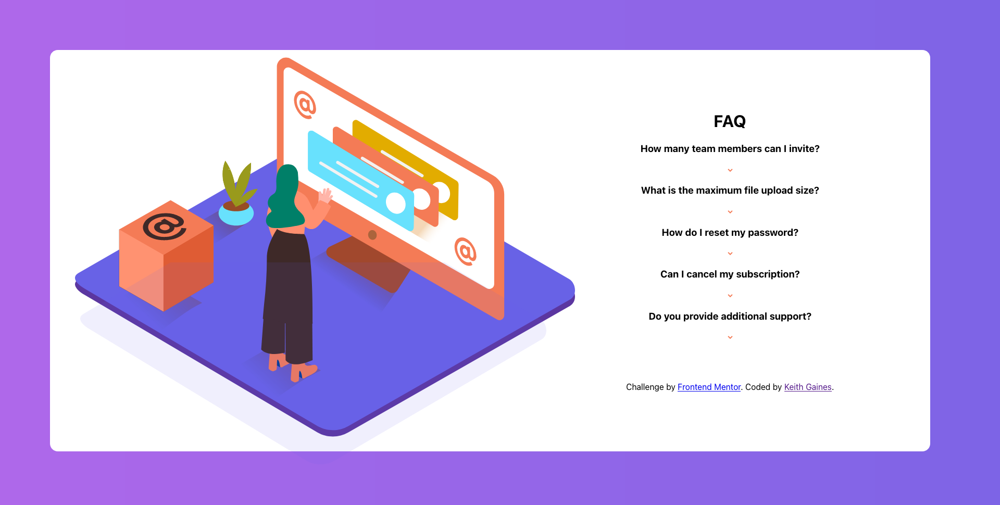

# FAQ accordion card 

This is a solution to the [FAQ accordion card challenge on Frontend Mentor](https://www.frontendmentor.io/challenges/faq-accordion-card-XlyjD0Oam). Frontend Mentor challenges help you improve your coding skills by building realistic projects. 

## Table of contents

- [Overview](#overview)
  - [The challenge](#the-challenge)
  - [Screenshot](#screenshot)
  - [Links](#links)
- [My process](#my-process)
  - [Built with](#built-with)
  - [What I learned](#what-i-learned)
  - [Continued development](#continued-development)
- [Author](#author)

**Note: Delete this note and update the table of contents based on what sections you keep.**

## Overview

### The challenge

Users should be able to:

- View the optimal layout for the component depending on their device's screen size
- See hover states for all interactive elements on the page
- Hide/Show the answer to a question when the question is clicked

### Screenshot

### Links

- Solution URL: [https://accordionfaq.vercel.app/](https://your-solution-url.com)
- Live Site URL: [https://accordionfaq.vercel.app/](https://your-live-site-url.com)

## My process

### Built with

- Mobile-first workflow
- [React](https://reactjs.org/) - JS library

### What I learned

This endeavor provided a valuable opportunity to enhance proficiency in React development. It also enabled the implementation of an innovative feature whereby a CSS transition was utilized to effectuate a 180-degree rotation of the arrow image on the Y-axis, thereby enhancing the visual appeal and user experience of the card expansion functionality.

### Continued development

As a committed React developer, I am determined to continue expanding my skill set in this domain. Towards that end, I plan to delve further into the intricacies of React development by gaining proficiency in the next.js React framework. This will enable me to deepen my understanding of React and leverage its full potential, thereby enhancing my ability to deliver superior-quality projects that are both robust and scalable.

## Author

- Website - [Keith Gaines](https://keithgaines.github.io)
- Frontend Mentor - [@keithgaines](https://www.frontendmentor.io/profile/keithgaines
